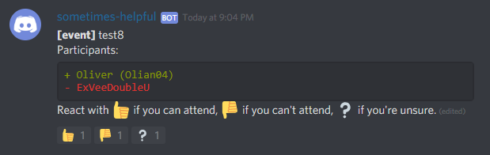

# discord-sometimes-helpful-bot
A discord chat bot that provides tools for orginizing and managing raiding.

## Commands

```
![command] [...args]
```

### !event \[title\]




## Planned features

* Ready check: Starting a ready check for a given voice chanel. Will display a checklist for all players in the voice channel. Will check as READY when a player reacts to the comment.
* Event planning: State that you are planning an event, then ppl may react with thumbs up/down/sideways depending on if they plan to attend or not. The event comment will update with a list of the ppl who have responded & in the order they responded.
* Automatic roll assignment based on the reacted emoji. 
