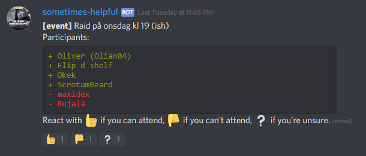

# discord-sometimes-helpful-bot
A discord chat bot that provides tools for organizing and managing raiding.

## `!event [title]`

State that you are planning an event, then ppl may react with thumbs up/down or questionmark depending on if they plan to attend or not. The event comment will update with a list of the ppl who have responded & in the order they responded.

## Planned features

### General Features

* Mark text channels as "command only" and delete all messages that does not contain commands.
* Update events by reacting with a :wrench: to an event. The bot the sends a PM to the user providing a set of operations (reactions); change the title, add a comment, remove event, etc...

### New Commands

* Ready check: Starting a ready check for a given voice chanel. Will display a checklist for all players in the voice channel. Will check as READY when a player reacts to the comment.
* Automatic roll assignment based on the reacted emoji.
* Help command that shows what the bot can do.
* Xur: Retrieves information about the destiny 2 NPC Xur.

## Prerequisite

* [nodejs](https://nodejs.org)
* [npm (included in newer versions of nodejs)](https://github.com/npm/cli/releases/tag/v6.10.0)
* [firebase account](https://firebase.google.com/)

## Install & Run

1. Make sure you have installed all prerequisite software
2. Grab your firebase [service account](https://firebase.google.com/docs/admin/setup) credentials.
3. Grab your discord-bot secret from the [discord developer portal](https://discordapp.com/developers/applications)
4. Create a `secrets.json` file and store your discord-bot secret as `discord_token` inside it, and store the firebase service account credentials as `firebaseConfig`.
5. Start the bot: `npm run start:prod`
