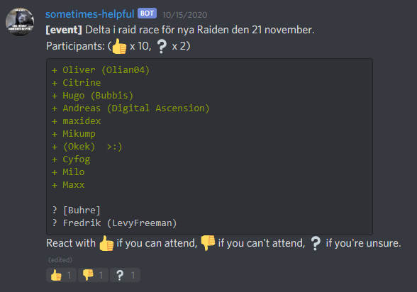
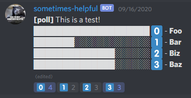

# discord-sometimes-helpful-bot

A discord chat bot that provides tools for organizing and managing events.

## `!event [title]`

State that you are planning an event, then ppl may react with :thumbsup: / :thumbsdown: or :grey_question: depending on if they plan to attend or not. The event comment will update with a list of the ppl who have responded & in the order they responded.
Reacting with a :wrench: will alow you to change the title of the event. The bot the sends a DM to the user providing further instructions.

## `!poll [title]; [option0]; (option1); (option2); .... (option9)`

Create a poll with the given title and a range of up to 10 different vote options. The title and each option (excluding the last) needs to end with a semicolon `;`.

## `!list`

Will PM you a list of all commands you have access to in the current channel. Buy default this list is empty. 
_**Note:** Admins have access to all commands in all channels._

## `!enable [cmd_name]`

Will enable a command in the current channel to be used by all members who can send messages in that channel. 
_**Note:** Admins can use all command in all channel, no matter if they are enabled in the channel or not._

## `!disable [cmd_name]`

Running `!disable my_command` will remove any privileges previously grated by running `!enable my_command`.

## Prerequisite

* [nodejs](https://nodejs.org)
* [npm (included in newer versions of nodejs)](https://github.com/npm/cli/releases/tag/v6.10.0)
* [firebase account](https://firebase.google.com/)

## Install & Run

1. Make sure you have installed all prerequisite software
2. Grab your firebase [service account](https://firebase.google.com/docs/admin/setup) credentials.
3. Grab your discord-bot secret from the [discord developer portal](https://discordapp.com/developers/applications)
4. Setup environment variables as seen in `.env.example`
5. Start the bot: `npm run start:prod`
